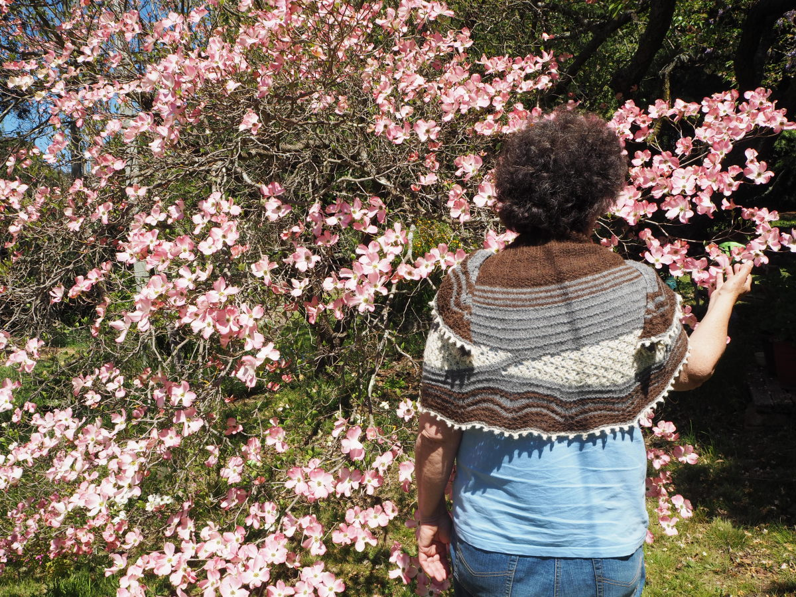
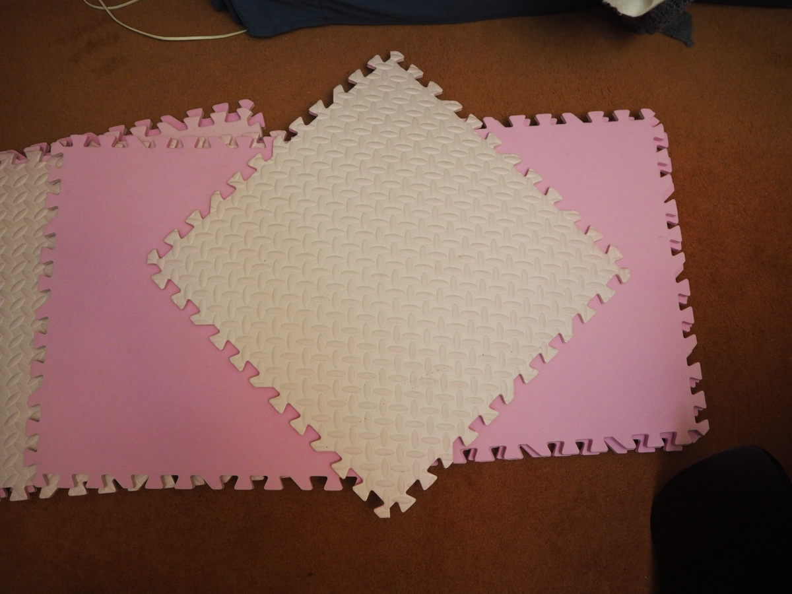

<!--more-->
## Pattern

Maighdean-ròin Shawl, [available from the designer's website](https://www.wolfandfaun.com/collections/shawl-collection/products/maighdean-roin-shawl-pattern) and described as:

> This shawl is a homage to my Gaelic roots and a journey though the legends of the Maighdeann-ròin. Also known as a selkie, in Gaelic lore a Maighdeann-ròin is a seal maiden caught on land against her will and taken as a wife when her seal skin is stolen away from her and carefully hidden by her husband so that she may never return to her true home the sea. Caught between land and sea as though trapped in a net, she forever searches for her seal skin until one day years later her children reveal its location to her. She acts without hesitation and immediately runs to the ocean shore, dons her skin and returns to the depths of the sea, forever after watching over her heartbroken human family from amidst the frothy white-capped churning ocean waves offshore.

Also sometimes titled Seal Maiden Shawl, and I cannot tell you how difficult it is finding a consistent hashtag on Instagram, because of the accent on the "o". Hashtags do not like characters with typographical marks, which sucks for everything that isn't bog-standard English.

## Designer

Nat Raedwulf of [Wolf & Faun Knits](https://www.wolfandfaun.com/), whose aesthetic I really like, and who has a large collection of shawl patterns of which I own a sizeable proportion. She designed the [Henwife shawl](https://www.wolfandfaun.com/collections/shawl-collection/products/the-hen-wife-shawl-knit-pattern), which I have also made and love.

## Yarn

Yarn is from [Adagio Mills](https://www.adagiomills.com.au/), an alpaca farm and yarn mill located in Orange, NSW (Australia) which came to my attention because my cousin lives out that way and is also a musical person, so clearly she knows the people who run the mill. They have alpacas with all different colour fleeces and the colourways of the yarn are based on the alpaca colour rather than being dyed. So they're all various shades of cream, brown and grey.

I used the [4 ply/fingering weight yarn in the colours Weathered Wood (dark brown), Concerto (grey) and Natural White (cream)](https://shop.adagiomills.com.au/collections/yarn/products/adagio-mills-4ply-alpaca-yarn-50g-balls).

## General commentary

The pattern came to my attention because I saw a picture of the sample on Instagram and was hooked because of how much it looked like an actual ocean, so I was completely sold on the mythos. This coupled neatly with my mum saying how she'd like something made out of Adagio Mills yarn (she lives in Lithgow, which is also in the Central West) and so I checked with her to see if this pattern would work for her. She said it would, so I proceeded to purchase yarn and then think about it for a long time and get through a number of other craft projects first.

Cast on on 17 March 2020, just in time for the start of COVID becoming a thing in Australia, and then finished on 17 April 2020, which is uncharacteristically fast and probably reflects the fact that EVERYTHING WAS ON FIRE SO LET'S KNIT. I had to restart from scratch once, because I dropped a stitch at the edge of a section and couldn't get it back into shape, despite various attempts to reconstruct the edge using pins stuck into the carpet - this was a lesson to use more lifelines, because the alpaca yarn is fuzzy and grippy, and likes to stick to itself.

The bind-off is a picot bind off and took years a while, but honestly I'm beginning to think that this is just par for the course when it comes to shawls, just because of how long the edges are. If I were knitting it again (which I am not unlikely to do, since I have yarn in colours A and B for this purpose and am just waiting to find a good colour C) I would make sure that the top edge is looser, because it's a bit restricted at the moment.

I finally got around to blocking the shawl this week \[_ed. this was early October_\], because it's my mum's birthday and this is a good opportunity to actually give it to her.

Posed photos of my mum with shawl were accomplished, and are in the selection of photos below.[^1] I think she looks super cute but don't tell her about them, because she doesn't like photos of herself.[^2]

[^1]: The dogs in the photos are English pointers called Michael and Juno. No, I don't know which is which without checking the undercarriage, and that didn't end up in my photos.
[^2]: Please note that I told her I would be putting photos on the internet when I took them, so she knows they exist - just in the abstract.

## Photos

### Photoshoot



### Completed



### WIP



## Notes re blocking and a cautionary tale about buying colourful blocking mats

I have been meaning to do a bunch of blocking for ages and, in pursuit of this goal, purchased some blocking pins from a knitting site and some squishy mats on eBay. The mats (which are 50cm by 50cm) came in grey or pink, and because we're living through a time that could use more colour, I bought the pink ones. Then, when they arrived, I realised that this was really stupid, because of how red dye (i.e. pink dye) is very unstable and therefore likely to run and affect the things being blocked. However, in a moment of inspiration, I realised that because red dye is so unstable, it will therefore break down pretty quickly in sunlight, which would resolve this problem! The foam mats were promptly put out in the backyard and left at the mercy of the elements for...some weeks?...until I thought they'd faded enough, and then they sat in the hallway and/or the shower recess until I got up the energy to wash them. They faded a LOT (see photo below that shows the original colour compared with the current colour).

