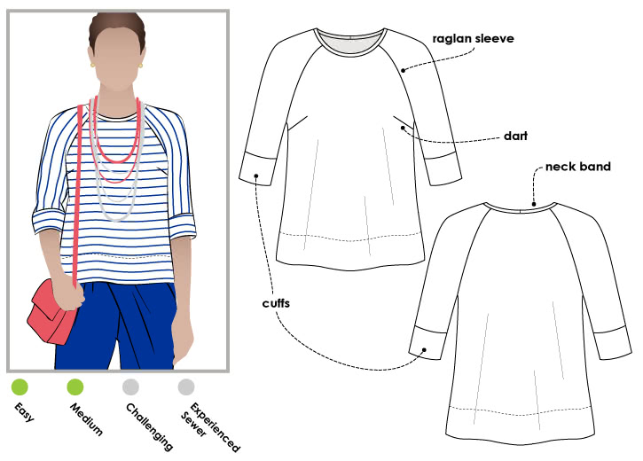

## Pattern

[Maddison Top from Style Arc](https://www.stylearc.com/shop/sewing-patterns/maddison-top/)

## Details

* Free pattern with purchase some time ago
* Wanted to make a new top for orchestra
* Had some black textured stable knit from Drapers Fabrics 50% off sale from New Zealand
* Printed pattern
* Stuck together in 20 min
* Made between 8:30 and 11:30 that night
* Had to redo the next day because the neckline was bodgy
* Took in at the back originally, but also needed to amend afterwards to take in at the front raglan seams
* Fixing the neckband helped things sit nicely
* Not really my style but totally wearable.
