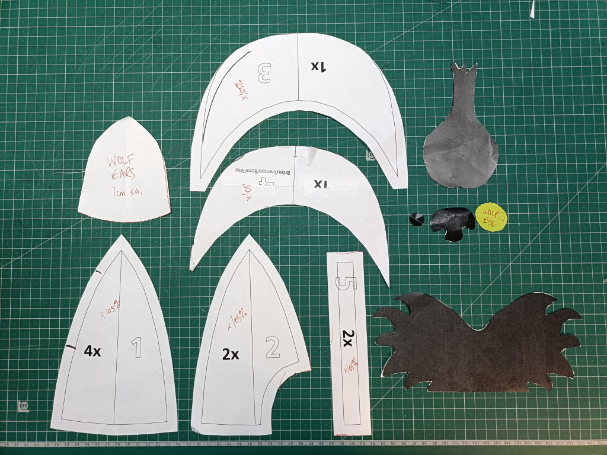

My orchestra performed Prokofiev's _Peter and the Wolf_ at our end of year family concert this month. The part of the Wolf is played by three French horns (of which I was the second horn and therefore probably the torso?) and the rest of the section did not object strenuously to wearing wolf accoutrements and thus I decided we should have matching costumes. We put the hats on for the soundcheck, and I'm pretty sure our first cued entry was a little later than usual because the conductor looked over at us and was trying not to laugh. He did point us out to the rest of the orchestra and they were all suitably appreciative.[^1]

[^1]: The only other person who put on a costume was the clarinettist (playing the role of the Cat) who had on cat ears. (The rest of the woodwinds were pikers.) The percussion told me they'd tried to find Hunter outfits but couldn't even come up with water pistols...

All in all: a success, and should be wearable for the next time I play _Peter and the Wolf!_

")

For the benefit of posterity, here are all the instructions. I had originally planned just to add ears, eyes and teeth to existing caps but it ended up being "easier" to make the caps too. I hacked a [free Bernina pattern for the cap](https://blog.bernina.com/en/2022/09/sewing-cap-free-pattern/), and got a wolf mask image off the internet.

## Materials

- Main fabric (green cotton drill): 4 x main cap piece, 2 x back cap piece, 2 x brim piece, 2 x fastening straps
- Lining fabric (green lightweight cotton): 4 x main cap piece, 2 x back cap piece
- Grey felt: 1 x wolf face, 1 x wolf snout, 4 x wolf ear
- Yellow felt: 2 x wolf eye
- Black felt: 2 x wolf pupil, 1 x wolf nose
- 1 x brim support in thin plastic
- 1 x set of pointy teeth in white card (thinking of changing to white plastic for washability)
- Hook and loop tape cut at 1 cm x 5 cm
- [Pattern from Bernina](Pattern_CapCosmo.pdf), scaled up to 105% because that hat was _small_
- [Wolf template](wolf-mask-templates.png), printed at 100% (except there's no digital copy of the ear piece, and the teeth are from a StyleArc costume pattern)

## Method

1. Sew together 2 ear pieces, trim seams and turn right side out. Repeat for second ear.
2. Sew two main pieces together with an ear in the middle. With seam pressed open, top stitch both sides of the seam, catching the ear seam allowance in either side. Repeat for other ear.
3. To each piece with an ear, attach a back cap piece. Topstitch both sides of the seam.
4. Join the two halves of the cap along the middle seam, then topstitch as before.
5. Sew two main lining pieces together. Repeat.
6. Attach back lining pieces to each set of lining pieces.
7. Join the two halves of the lining along the middle seam.
8. For each fastening strap piece, press the long edges towards the middle so there is no gap, then fold the strap so the short edges are together and press.
9. Unfold and sew hook tape to one and loop tape to the other.
10. Baste fastening straps onto the back of the main cap, approx 1 cm from the raw edge.
11. Sew brim pieces together at the front seam, trim seams and turn right side out. Insert plastic brim support and then baste the raw edged side to keep the brim support tight.
12. Attach brim to main cap.
13. Attach lining to main cap at the back semicircle first, and then around each side until an inch or so past the brim.
14. Fold in the lining under the brim by 1cm and pin in place.
15. Topstitch around the edges of the head part of the cap so that you catch the lining near the brim securely.
16. Glue eyes, pupils and nose to wolf face and snout.
17. Hot glue wolf face to cap along the centre seam, with the bottom of the face lined up with the top of the brim. Hot glue snout on top of wolf face.
18. Hot glue teeth under the brim of the cap.

## Process

I had acquired 3 caps from Sewing Helper that she was OK with me repurposing, but then I would have had to cover the original colour (one of them was VERY pink, see photo) and unpick the seams for the ears, and I happened to have leftover dark green cotton drill (like a **FOREST**), so it was nicer to make the caps.

There's probably a better process to make a cap, but I was working to a deadline and this was serviceable. I originally thought omitting the lining would be easier, but then I couldn't work out how to finish the raw edges of the main cap, and so it was easier just to cut and sew 18 pieces of lining than try and work out something new. I tried sewing the lining seam all the way around instead of securing the front lining by topstitching, but the brim was just too difficult to work with.

The first hat took quite a while, but it was the prototype. Hats #2 and #3 were extremely efficient!

The teeth are currently white cardstock, but this means the hats aren't washable, so I'm thinking of changing them to white plastic instead.


